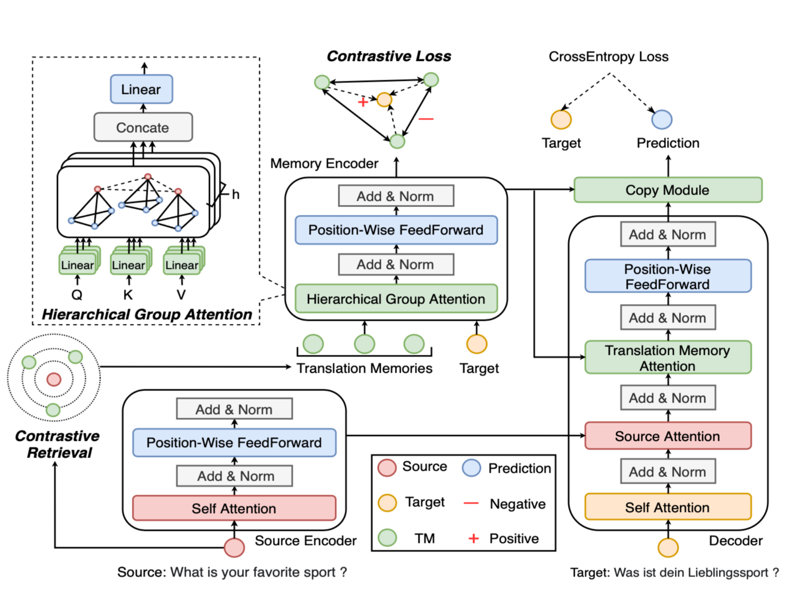

## Neural Machine Translation with Contrastive Translation Memories
This repository contains the code and data for this EMNLP2022 paper
`Neural Machine Translation with Contrastive Translation Memories`, [link](). The main idea of this paper is to exploit contrastive translation memories in retrieval-augmented NMT system.

